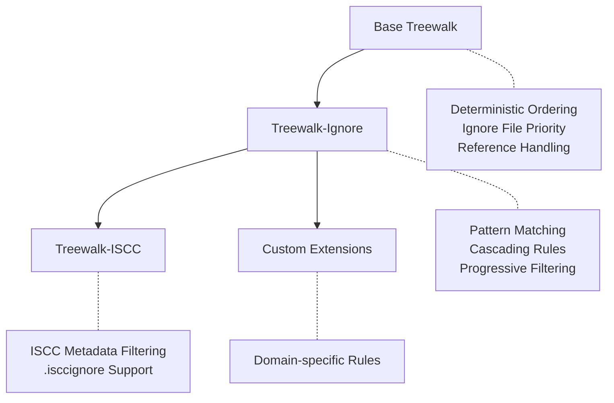

# Treewalk - Storage Agnostic Deterministic Incremental Tree Traversal

> **At a Glance**: A deterministic algorithm for traversing hierarchical structures that produces consistent,
> reproducible ordering across platforms and storage types.

## Abstract

This specification defines a layered approach to deterministic tree traversal, consisting of a core algorithm
and two standard extensions. The base **Treewalk** algorithm provides consistent ordering for hierarchical
storage structures. The **Treewalk-Ignore** extension adds gitignore-style pattern filtering, while
**Treewalk-ISCC** provides domain-specific filtering for ISCC metadata. Each layer builds upon the previous,
ensuring consistent cross-platform ordering while enabling progressive filtering capabilities. The specification
applies to file systems, archive formats (ZIP, EPUB, DOCX), cloud storage (S3, Azure Blob), and any system with
directory-like organization.

## Relevance to Scientific Data: Zarr and OME-NGFF

> [!NOTE]
> The bioimaging community's adoption of Zarr-based formats like OME-NGFF makes deterministic tree traversal
> essential for reproducible scientific workflows.

### Why Treewalk Matters for Zarr/OME-NGFF

**Zarr** stores N-dimensional arrays as hierarchical directory structures containing thousands of chunk files,
while **OME-NGFF** (Next-Generation File Format) builds bioimaging standards on top of Zarr. Both formats face
critical challenges that Treewalk addresses:

1. **Cross-platform reproducibility**: Zarr hierarchies yield different traversal orders on different systems,
   breaking checksums and making data verification impossible. Treewalk ensures identical ordering whether data
   resides on Linux, Windows, S3, or within ZIP archives.

2. **Version compatibility**: Zarr v2 uses `.zarray`/`.zgroup` metadata files while v3 uses `zarr.json`.
   Treewalk's ignore-file prioritization ensures metadata is always discovered before data chunks, regardless of
   version.

3. **Scalable integrity verification**: Petabyte-scale OME-NGFF datasets contain millions of chunks. Treewalk
   enables efficient, incremental checksumming by guaranteeing chunk processing order remains consistent across
   implementations.

4. **Storage-agnostic identification**: Whether Zarr data lives in local filesystems, cloud buckets, or is
   packaged for distribution, Treewalk is the foundation for producing identical content identifiers, enabling
   reliable data citation and provenance tracking.

### Real-world Impact

Without deterministic traversal, two researchers cannot verify they have identical Zarr datasets—file listing
order varies by OS, locale, and storage backend. Treewalk makes reproducible computational science possible by
ensuring that content-based identifiers remain stable across all environments where scientific data is stored,
processed, and shared.

## Status

This specification is DRAFT as of 2025-01-17.

## 1. Introduction

### 1.1 Motivation

Content-based identifiers and integrity verification systems require deterministic file ordering to produce
consistent results across different environments. Traditional directory traversal methods yield entries in file
system-dependent order, making reproducible hashing impossible. This specification solves that problem through a
layered approach that separates core traversal logic from filtering concerns.

### 1.2 Scope

This specification defines three layers:

**Base Treewalk**:

- Deterministic ordering of hierarchical entries
- Ignore file prioritization for early filtering opportunities
- Security considerations for reference handling

**Treewalk-Ignore Extension**:

- Gitignore-style pattern matching
- Cascading ignore rules from root to leaf directories
- Pattern accumulation and inheritance

**Treewalk-ISCC Extension**:

- ISCC-specific metadata filtering
- Built on top of Treewalk-Ignore functionality
- Domain-specific file exclusions

It does NOT cover:

- Content reading or hashing algorithms
- Storage-specific authentication or access control
- Entry metadata beyond names and types
- Implementation details for specific storage systems

### 1.3 Notation and Conventions

The key words "MUST", "MUST NOT", "REQUIRED", "SHALL", "SHALL NOT", "SHOULD", "SHOULD NOT", "RECOMMENDED",
"MAY", and "OPTIONAL" in this document are interpreted as described in [RFC 2119] and [RFC 8174].

## 2. Terminology

**Entry** : A named object within a hierarchical storage system (file, directory, archive member, S3 object).

**Container** : An entry that can contain other entries (directory, folder, ZIP archive, S3 prefix).

**NFC Normalization** : Unicode Normalization Form C - a canonical form ensuring consistent representation of
equivalent Unicode sequences.

**Ignore File** : An entry whose name starts with "." and ends with "ignore" (e.g., .gitignore, .isccignore)
containing patterns for entries to exclude.

**Reference** : A storage-specific link to another entry (symbolic link, archive member reference, S3 redirect).

## 3. Architecture Overview

The Treewalk specification defines a layered architecture where each extension builds upon the previous:



Each layer maintains the core guarantees while adding specific functionality:

- **Base Treewalk**: Provides deterministic ordering across all platforms
- **Treewalk-Ignore**: Adds configurable filtering with pattern inheritance
- **Treewalk-ISCC**: Implements ISCC-specific requirements
- **Custom Extensions**: Enable domain-specific adaptations

## 4. Core Algorithm Specification

### 4.1 Entry Ordering

> 💡 **Quick Reference**: Sort entries by NFC-normalized UTF-8 encoded names

All directory entries **MUST** be sorted using the following algorithm:

1. Apply Unicode NFC normalization to each entry name
2. Encode the normalized name as UTF-8
3. Sort entries by comparing the resulting byte sequences lexicographically

When multiple entries have identical names after NFC normalization, implementations **MUST** treat them as
duplicates and handle them according to the storage system's native behavior (typically only one will be
accessible).

#### Example

Given entries: ["café", "caffe", "Café"]

After NFC normalization and UTF-8 encoding, the sorted order is:

- "Café" (capital C sorts before lowercase)
- "café"
- "caffe"

### 4.2 Base Treewalk Algorithm

The base algorithm **MUST** return entries in each container in this order:

1. **Ignore files first** - Entries matching pattern `.*ignore` (e.g., .gitignore, .npmignore, .isccignore)
2. **Regular entries** - All other non-container entries in sorted order
3. **Sub-containers** - Recursively in sorted order

> [!NOTE]
> This ordering ensures ignore files are available to callers and extensions before the entries they might 
> filter.

The base algorithm itself MUST not process ignore file contents or apply filtering.

### 4.3 Reference Handling

The algorithm **MUST NOT** follow references when:

- Determining if an entry is a regular entry or container
- Recursing into sub-containers

References (symbolic links, redirects) MUST NOT appear in traversal output AND MUST NOT be followed.

## 5. Treewalk-Ignore Extension

### 5.1 Overview

The **Treewalk-Ignore** extension adds gitignore-style pattern filtering to the base algorithm. It maintains the
same deterministic ordering while progressively filtering entries based on accumulated patterns.

### 5.2 Pattern Processing

When using Treewalk-Ignore:

1. The implementation specifies which ignore file to process (e.g., `.gitignore` OR `.npmignore`)
2. Check for the specified ignore file in each directory
3. Parse patterns using gitignore-style syntax
4. Accumulate patterns from root to current directory
5. Filter entries based on accumulated patterns
6. Apply patterns to both files and directories

> [!WARNING]
> Directory patterns must be checked with a trailing "/" to ensure proper matching

#### Pattern Matching Rules

- Pattern matching **MUST** be case-sensitive
- Only one ignore file type is processed per traversal (specified by the implementation)
- Later patterns have higher precedence than earlier patterns within the same file
- Child directory patterns have higher precedence than parent directory patterns
- Patterns from child directories override patterns from parent directories

### 5.3 Example with .gitignore

```
repo/
├── .gitignore (contains: *.log, temp/)
├── src/
│   ├── main.py
│   └── debug.log
└── temp/
    └── cache.dat

Yields only:
- repo/.gitignore
- repo/src/main.py
```

> [!NOTE]
> The ignore file itself is included in the output (unless excluded by a parent ignore file)

## 6. Treewalk-ISCC Extension

### 6.1 Overview

The **Treewalk-ISCC** extension provides ISCC-specific filtering on top of Treewalk-Ignore. It automatically
filters metadata files while respecting `.isccignore` patterns.

### 6.2 Automatic Exclusions

Treewalk-ISCC **MUST** exclude:

- Files ending with `.iscc.json` (ISCC metadata files)
- Any patterns specified in `.isccignore` files

### 6.3 Implementation

Treewalk-ISCC is implemented as:

1. Apply Treewalk-Ignore with `.isccignore` as the ignore file name
2. Additionally filter out files ending with `.iscc.json`

This layered approach ensures consistent behavior while adding domain-specific rules.

> [!NOTE]
> The automatic exclusion of `.iscc.json` files cannot be overridden by `.isccignore` patterns. These files are
> always excluded, even if `.isccignore` contains patterns that would otherwise include them.

## 7. Implementation Guidance

### 7.1 Storage System Adaptation

#### File Systems

- Use native directory listing APIs (e.g., `os.scandir()`)
- Filter symbolic links during initial scan
- Resolve paths to absolute form before traversal
- On Windows, handle drive roots (e.g., `C:\`) as valid starting points

#### Archive Formats (ZIP, EPUB, DOCX)

- Treat archive members as entries
- Use "/" as universal path separator
- Process nested archives as sub-containers
- Apply the same NFC normalization to member names

#### Cloud Storage (S3, Azure Blob)

- Use prefix-based queries for "directory" listing
- Treat key prefixes ending with "/" as containers
- Batch API calls for efficiency
- Skip zero-byte objects with keys ending in "/" (S3 directory markers)

### 7.2 Path Representation

- Use forward slash (/) as universal path separator
- Calculate relative paths from traversal root
- Apply NFC normalization before any path operations

### 7.3 Security Considerations

- **MUST** validate that all paths remain within the traversal root
- **MUST NOT** follow references to prevent traversal attacks
- **SHOULD** implement depth limits for deeply nested structures
- **SHOULD** enforce size limits when processing archives

## 8. Extensibility

### 8.1 Custom Extensions

Implementations **MAY** create additional extensions following the layered pattern:

1. Build on top of existing layers (Base → Ignore → Domain-specific)
2. Maintain deterministic ordering guarantees
3. Document extension-specific behavior clearly

### 8.2 Custom Ignore Files

Treewalk-Ignore implementations **MAY** support different ignore file names by allowing the caller to specify
which ignore file to process:

- `.gitignore` - Git-style ignores
- `.npmignore` - NPM-style ignores
- `.isccignore` - ISCC-specific ignores
- `.customignore` - Domain-specific ignores

> [!NOTE]
> Each traversal processes only one type of ignore file as specified by the implementation or caller

## 9. Test Vectors

Implementations **MUST** produce identical ordering for these test cases:

### 9.1 Base Treewalk Tests

#### Test Case 1: Unicode Normalization

**Structure:**

```yaml
- path: Café.txt
- path: café.txt
- path: caffe.txt
```

**Expected (Base Treewalk):**

```yaml
- test_dir/Café.txt
- test_dir/caffe.txt
- test_dir/café.txt
```

#### Test Case 2: Ignore File Priority

**Structure:**

```yaml
- path: .gitignore
- path: aaa.txt
- path: zzz.txt
```

**Expected (Base Treewalk):**

```yaml
- test_dir/.gitignore
- test_dir/aaa.txt
- test_dir/zzz.txt
```

### 9.2 Treewalk-Ignore Tests

#### Test Case 3: Pattern Filtering

**Structure:**

```yaml
- path: .gitignore
  content: "*.log"
- path: app.py
- path: debug.log
- path: error.log
```

**Expected (Treewalk-Ignore with .gitignore):**

```yaml
- test_dir/.gitignore
- test_dir/app.py
```

### 9.3 Treewalk-ISCC Tests

#### Test Case 4: ISCC Metadata Filtering

**Structure:**

```yaml
- path: .isccignore
  content: "temp/"
- path: data.txt
- path: data.txt.iscc.json
- path: temp
  type: dir
- path: temp/cache.dat
```

**Expected (Treewalk-ISCC):**

```yaml
- test_dir/.isccignore
- test_dir/data.txt
```

## 10. References

### Normative

- Unicode Standard Annex #15: Unicode Normalization Forms
- RFC 3629: UTF-8, a transformation format of ISO 10646

### Informative

- gitignore(5) - Git ignore patterns specification
- ISO 24138:2024 - International Standard Content Code
- ZIP File Format Specification
- Amazon S3 API Reference
